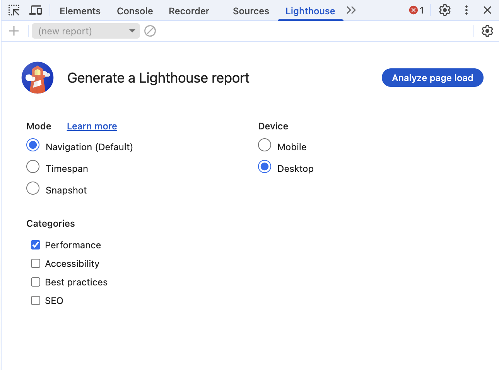

## Lighthouse

Lighthouse를 실행하면 위와 같은 화면을 볼 수 있는데 옵션을 고른 후 `Analyze page load`를 누를러 검사를 시작할 수 있습니다. 

### options

각 옵션 중 Mode와 Categories에 대한 설명은 다음과 같습니다.

#### Mode

- Navigation: Lighthouse의 기본 값으로, 초기 페이지 로딩 시 발생하는 성능 문제를 분석
- Timespan: 사용자가 정의한 시간 동안 밸상한 성능 문제를 분석
- Snapshot: 현재 상태의 성능 문제를 분석

#### Categories

- Performance: 웹 페이지의 로딩 과정에서 발생하는 성능 문제를 분석
- Accessibility: 서비스의 사용자 접근성 문제를 분석
- Best practices: 웹사이트의 보안 측면과 웹 개발의 최신 표준에 중점을 두고 분석
- SEO: 검색 엔진에서 얼마나 잘 크롤링되고 검사 결과에 표시되는지 분석
- Progressive Web App: 서비스 워커와 오프라인 동작 등, PWA와 관련된 문제를 분석

### 검사 결과

가장 위에 보이는 그래프가 Lighthouse가 측정한 이 웹 페이지의 종합 성능 점수입니다. 
이 점수는 아래에 보이는 다섯 가지 지표(metrics)에 가중치를 적용해 평균 낸 점수입니다.

#### First Contentful Paint (FCP)

페이지가 로드될 때 브라우저가 DOM 콘텐츠의 첫 번째 부분을 렌더링하는 데 걸리는 시간에 관한 지표입니다. 위 결과에서는 페이지 진입하여 첫 콘텐츠가 뜨기까지 0.2초가 걸렸음을 알 수 있습니다.

FCP는 총점을 계산할 때 `10%의 가중치`를 갖습니다.

#### Total Blocking Time (TBT)
페이지가 클릭, 키보드 입력 등의 사용자 입력에 응답하지 않도록 차단된 시간을 총합한 지표입니다. 
FCP와 TTI 사이의 시간 동안 일어나며 메인 스레드를 독점하여 다른 동작을 방해하는 작업에 걸린 시간을 총합합니다.

TBT는 총점을 계산할 때 `30%의 가중치`를 갖습니다.

#### Speed Index (SI)
페이지 로드 중에 콘텐츠가 시작적으로 표시되는 속도를 나타내는 지표입니다. 
다음과 같이 A페이지와 B페이지가 있을 때, 완료에 걸리는 시간이 같더라도 일부 콘텐츠가 더 빠르게 노출되는 A가 더 높은 점수를 받을 수 있습니다. 

- A: 페이지 진입 -> 2초(스켈레톤 컴포넌트 노출) -> 4초(완료)
- B: 페이지 진입 -> 4초(완료)

SI는 총점을 계산할 때 `10%의 가중치`를 갖습니다.

#### Largest Contentful Paint (LCP) 
페이지 로드 중에 가장 큰 이미지나 텍스트 요소가 표시되는 시간에 관한 지표입니다. 
위 결과에서 페이지에 진입하여 가장 큰 콘텐츠가 뜨기까지 1.3초가 걸렸음을 알 수 있습니다.

LCP는 총점을 계산할 때 `25%의 가중치`를 갖습니다.

#### Cumulative Layout Shift (CLS)
페이지 로드 과정에서 발생하는 예기치 못한 레이아웃 이동을 측정한 지표입니다. 
레이아웃 이동이란 화면 상에서 요소의 위치나 크기가 순간적으로 변하는 것을 말합니다.

CLS는 총점을 계산할 때 `25%의 가중치`를 갖습니다.

### Diagnostics

Lighthouse 지표 화면에서 아래로 스크롤을 내려보면 성능과 관련된 기타 정보를 보여줍니다. 
이 섹션을 통해 해당 서비스의 어느 부분을 개선해야 성능을 향상할 수 있는지 쉽게 파악할 수 있습니다.